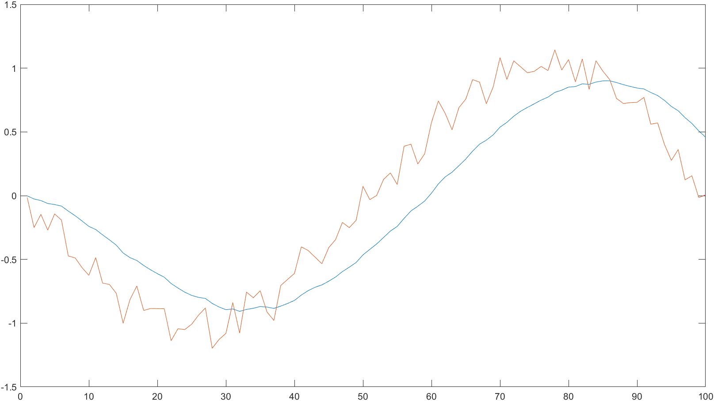
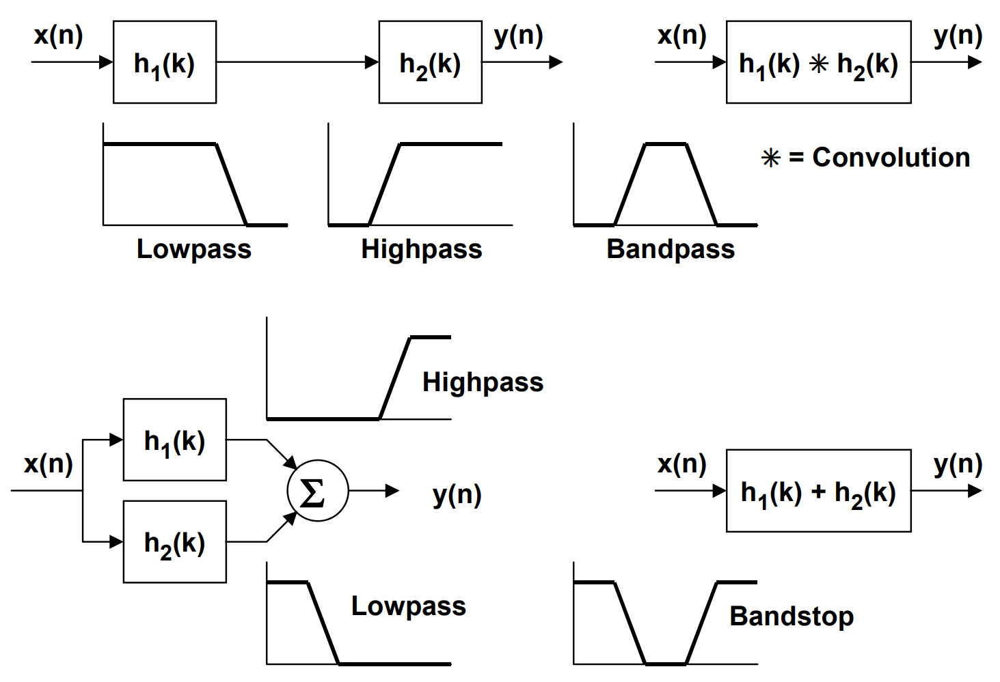
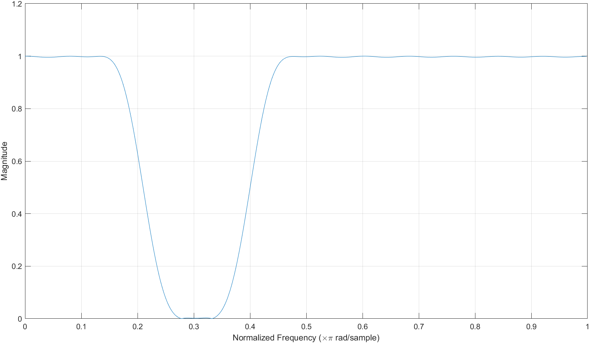
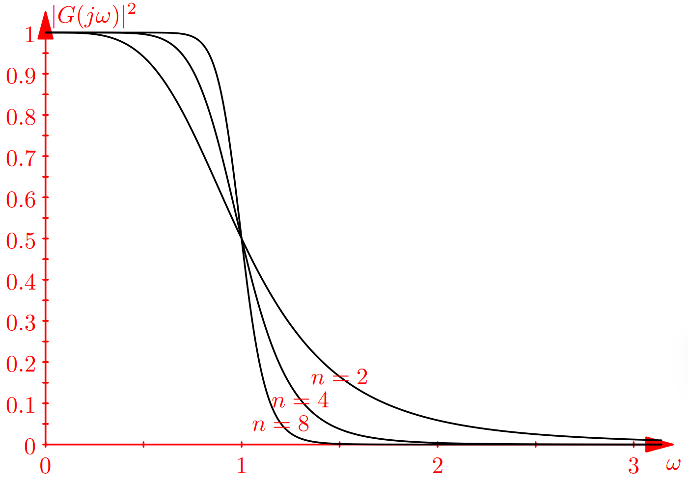
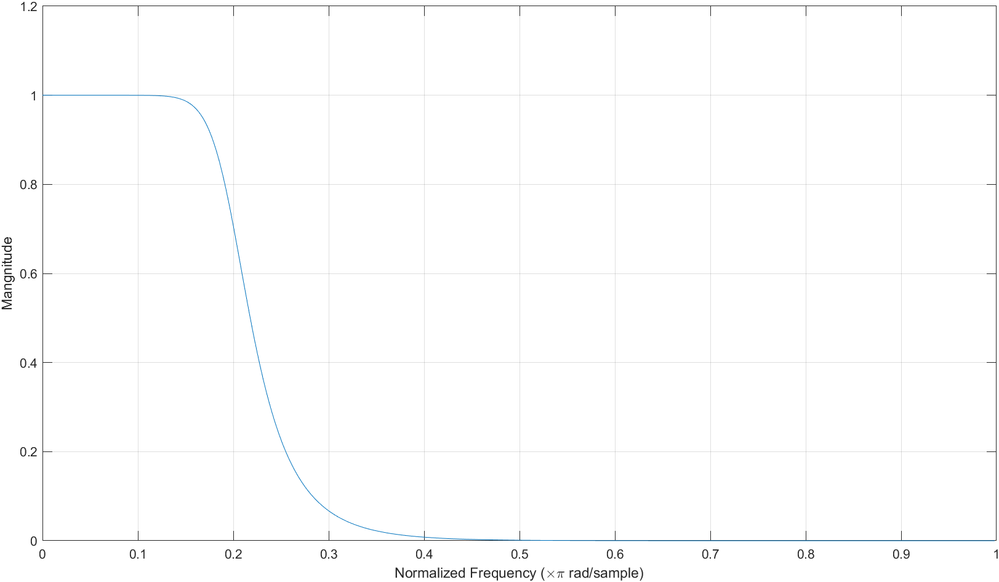
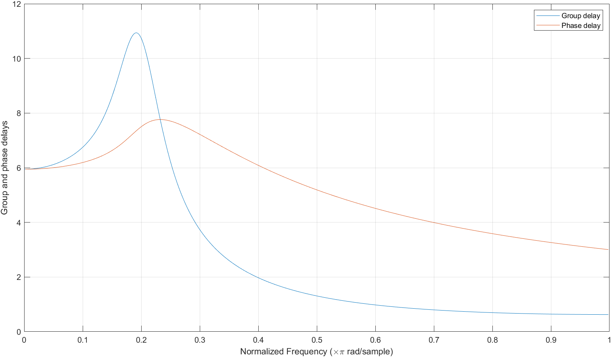

# Chapter 4. General program design of filter


## 信号处理与数据估计

对随机信号的时间演化进行估计是一类常见任务。通常根据可用数据因果性，这些估计有更具体名称：

- 滤波（filter）: 基于系统前n时刻的历史数据（含当前）估计下一时刻数据。

- 平滑（smooth）: 收集系统一段时间n内数据，根据所有数据，得到每个时刻的数据。

- 预测（predict）: 基于系统前n时刻的历史数据（含当前）估计n+t刻数。

三种任务本质上同源，只是根据时间因果性进行区分。因此很多算法稍作改变就能互通：如Savizkg-Golay平滑算法被称作Savizkg-Golay滤波器；均值滤波器的与滑动平均有同样的数学表达。除有特殊情况，之后视作等同。

本章讨论统计线性滤波器通用数学模型与程序设计方法。


## 统计线性滤波器

### 通用型线性滤波器设计
#### 统计线性滤波器的数学模型

随机过程的频域分析法是提取信号中周期成分然后再进行积分变换在频率域上分析的一种手段。其理论基础是随机过程本身能被模拟成各种特定频率谐波叠加的系统。在这之上操作这些谐波成分的技术称为统计线性估计/滤波/平滑。

在以上假设下，将随机过程$x_t$输入以下差分系统：
$$
y_{n}=\sum_{k=0}^{M} c_{k} x_{n-k}+\sum_{j=0}^{N-1} d_{j} y_{n-j-1} \tag{1}
$$
其中$y_n$是在系统对应离散输入$x_t$的输出。通过给输入与输出设定不同的系数，就能组合出特定性质的$y_t$。当等式右边项$y$相关系数都是零时，系统只与过去时刻输入有关，具有有限项、因果性、绝对稳定性，此时称为有限递归滤波器（FIR）；当右边项$y$相关系数不为零，系统输出与过去时刻输出有关，具有条件稳定性、因果性。相比FIR系统增加了反馈环节，等同于加入了无穷多项输入，称作无穷递归滤波器（IIR）[^1]。所有的线性滤波器都是这两类滤波器的特例。

该差分系统的频率域响应：
$$
H(f)=\frac{\sum_{k=0}^{M} c_{k} e^{-2 \pi i kf }}{1-\sum_{j=0}^{N-1} d_{j} e^{-2 \pi i(j+1)f }} \tag{2}
$$
其中$f$是使用采用频率进行归一化后的频率。改变系数能相应改变频率响应函数形状，因此通过这种方式设计的滤波器称作频率成形滤波器[^2]。

特别注意在scipy.signal等软件包中，会限制$-0.5\le f\le0.5$[^3]。因为式2通过Laplace变换连续时间域得到系统传递函数，但实际上采样是离散过程，需要使用z变换到离散频率域。当离散系统采样频率$f_s\le 2f$时，Laplace变换与z变换转换中存在混叠效应。因此这些软件包中会限制一半的频率使用，如$f_s=8000Hz$，那么滤波器频率设定范围只有$4000Hz$，这种频率称为Nyquist频率。

#### 统计线性滤波器的程序设计

线性统计滤波器的程序设计是围绕式1进行。式1是两项卷积之和，每项卷积有如下加乘累计结构：


这种置换卷积对应于固定位置索引与先进先出（FIFO）的队列元素的乘积和。将滤波器系数置入固定数组，然后将队列元素依次加成就得到滤波结果。

#### 用户接口

`Filter`类是ppx实现的一般统计线性滤波器设计与使用接口，定义对应有理传递函数有如下形式：
$$
Y(z)=\frac{b(1)+b(2) z^{-1}+\ldots+b\left(n_{b}+1\right) z^{-n_b}}{1+a(2) z^{-1}+\ldots+a\left(n_{a}+1\right) z^{-n_{a}}} X(z)
$$
这种形式能同时处理FIR与IIR型滤波器，其中$n_a$是反馈滤波器阶数，$n_b$是前馈滤波器阶数。由归一化设定$a(1)=1$。还可以将有理传递函数表示为以下差分方程：
$$
a(1)y(n)=b(1)x(n)+b(2)x(n-1)+\cdots +b(n_b+1)x(n-n_b)-a(2)y(n-1)-\cdots -a(n_a+1)y(n-n_a)
$$

**功能**

| 构造方法     |                                           |
| ------------ | ----------------------------------------- |
| constructor  | 滤波器类型：低通（默认值）/高通/带通/带阻 |
| **成员方法** |                                           |
| coff_a       | 返回反馈滤波器系数                        |
| coff_b       | 返回前馈滤波器系数                        |
| reset        | 重置滤波器状态                            |
| operator()   | 滤波操作                                  |

**示例**

使用有理传递函数$H(z)=\frac{1}{1-0.9z^{-1}}$对数据进行滤波。

创建由正弦谐波与白噪声组合的输入数据：

```c++
std::vector<double> datas1;
MultiNormalDistribution<1> rand(0 , 0.1);
for (int i = 0; i < 100; ++i)
{
    double sample_point = -PI + (double)i / 50 * PI;
    datas1.emplace_back(sin(sample_point) + rand());
}
```

创建统计线性滤波器，并设定有理传递函数的分子和分母系数：

```c++
Filter flt;
flt.coff_a() = {0.1};
flt.coff_b() = {1.0, -0.9};
```

对生成数据进行滤波：

```c++
for (auto x : datas1)
{
    auto y = flt(x);
}
```




### FIR（Finite Impulse Response）型滤波器设计

#### 理想有限脉冲响应滤波器

FIR型滤波器系统简单表达为：
$$
y_{n}=\sum_{k=0}^{M} c_{k} x_{n-k} \tag{3}
$$

对应频率响应为：
$$
H(f)=\sum_{k=-\infin}^{\infin} h_{k} e^{-j2 \pi  kf }
$$
这是FFT-IFFT变换对。通过改变对应谐波$\Omega=2\pi f$响应系数$h_k$得到时域上不同信号形状：
$$
H(\Omega)=\sum_{k=-\infty}^{\infty} h[n] \cdot e^{-j k \Omega}\\
h[n]=\frac{1}{2 \pi} \int_{-\pi}^{\pi} H(\Omega) \cdot e^{j n \Omega} d \Omega
\tag{4}
$$
故设计FIR滤波器可以直接将频率响应进行反积分变换得到系数$h[n]$。

以设计截止频率为$\Omega_c$的理想低通滤波器为例，其频率响应为：


即：
$$
H(\Omega)=\begin{cases} 1\quad(-\Omega_c\le\Omega\le\Omega_c)\\ 0\quad(else) \end{cases}
\tag{5}
$$
作IFFT：
$$
h[n]=\frac{1}{2\pi}\int_{-\Omega_c}^{\Omega_c}{1\cdot e^{jn\Omega}d\Omega}=\frac{1}{2\pi}[\frac{e^{jn\Omega}}{jn}]_{-\Omega_c}^{\Omega_c}=\frac{\Omega_{c}}{\pi} \cdot \frac{\sin \left(n \Omega_{c}\right)}{\left(n \Omega_{c}\right)}=2 f_{c} \cdot \frac{\sin \left(n \Omega_{c}\right)}{\left(n \Omega_{c}\right)}
\tag{6}
$$
将式6回代入式3，得理想低通滤波器时域表达式。对该无穷级数求部分和做近似。式6是偶函数，选取中心取左右$M$点，共$N=2M+1$阶作为级数部分和。考虑因果性，将负周期前移至正半周期：
$$
H(z)=\sum_{n=-M}^{M} h[n] \cdot z^{-(n+M)}
\tag{7}
$$
以上平移与对称性表示：

一、滤波器某时刻值与该点前和该点后数据相关，即N时刻值是由N-M和N+M这些过去与未来的数据推断，这正是1.1节中所描述的平滑任务。

二、考虑到滤波任务的因果性，我们将信号整体平移M周期，即在频率域中乘以$z^{-M}$，获得$[0,2M]$时刻数据才推断M时刻数据。这带来了相位的扭曲：对于信号$y=x(t-t_0)$，相当于信号$y=x(t)$通过$H(jw)=e^{-jwt}$环节，它使系统的所有谐波成分整体相位偏移对应$t_0$周期。这种对每个谐波成分的相位扭曲称作群延迟，是滤波器相位特性的来源。

式6给出理想低通滤波器环节的反变换。相应的，理想高通、带通、带阻对应时域表达式：

| 类型 | $h[n],n\ne0$                                                 | $h[n],n=0$  |
| ---- | ------------------------------------------------------------ | ----------- |
| 低通 | $2f_c\frac{sin(n\Omega_c)}{n\Omega_c}$                       | $2f_c$      |
| 高通 | $-2f_c\frac{sin(n\Omega_c)}{n\Omega_c}$                      | $1-2f_c$    |
| 带通 | $2f_2\frac{sin(n\Omega_2)}{n\Omega_2}-2f_1\frac{sin(n\Omega_1)}{n\Omega_1}$ | $2f_2-2f_1$ |
| 带阻 | $2f_2\frac{sin(n\Omega_2)}{n\Omega_2}+2f_1\frac{sin(n\Omega_1)}{n\Omega_1}$ | $2f_2+2f_1$ |

#### 窗函数法

对式7进行有限截断导出的滤波器频域特性和理想滤波器存在区别，主要是频响有相当明显波纹：


为了去除波纹，需要对频谱使用一些函数进行进行二次加工，这些函数称作窗函数。这些窗函数能较好改变通带与阻带特性，与理想滤波器一起构成了实际使用的FIR滤波器。以三角窗（又称bartlett窗）为例，其时域上是一个三角形，而频域上则对主瓣以外成分有强烈衰减：


常用窗函数的时域表达式如下：

| 类型        | $w(n)$                                                       |
| ----------- | ------------------------------------------------------------ |
| Rectangular | 1                                                            |
| Hanning     | $0.5-0.5\cos(\frac{2\pi n}{N-1})$                            |
| Hamming     | $0.54-0.46\cos(\frac{2\pi n}{N-1})$                          |
| Blackman    | $0.42-0.5 \cos \left(\frac{2 \pi n}{N-1}\right)+0.08 \cos \left(\frac{2 \pi n}{N-1}\right)$ |

将窗函数叠加到理想滤波器系数，就得到最终滤波器系数$h[n]*w[n]$。

#### 频幅响应与相位偏移

本节给出FIR的频幅响应与相位偏移。根据式4，其传递函数为：
$$
H(j \omega)=\sum_{n=-M}^{M} h[n] \cdot e^{-j \omega T(n+M)}=e^{-j \omega T M} \sum_{n=-M}^{M} h[n] \cdot e^{-j \omega T_{n}}
\tag{7}
$$
其中$T$是采样周期。假设系数是对称分布的，有：
$$
\begin{aligned}
H(j \omega) & =e^{-j \omega T M}\left\{h(0)+\sum_{n=1}^{M} h[n] \cdot\left(e^{j \omega T n}+e^{-j \omega T n}\right)\right\} \\
& =e^{-j \omega T M}\left\{h(0)+\sum_{n=1}^{M} h[n] \cdot 2 \cos (\omega T n)\right\}
\end{aligned}
\tag{8}
$$
式8表明，该系统对对频率$w$谐波成分会产生$-wTM$线性相位偏移，此斜率即群延迟。FIR滤波器有着线性相位偏移，即对任何频率谐波成分，有相同群延迟，对应于整个系统输入延迟$TM$时间。

#### FIR型滤波器程序实现

FIR型滤波器整体沿用通用线性滤波器框架，特性在于如何根据低通滤波器系数计算高通、带通、带阻滤波器相应脉冲响应系数$h[n]$。

假设现已根据窗函数法求出截止频率$\Omega_c$低通滤波器频率响应$H_{lp}(f)$，相应高通滤波器系数$H_hp(f)$与之存在对应关系[^4]：
$$
\begin{aligned}
H_{lp}(f)+H_{hp}(f)&=1\\
h_{lp}[n]+h_{hp}[n]&=\delta[n]
\end{aligned}
\tag{9}
$$
即将低通滤波系数符号取相反，中心项加一得对应高通滤波器：

```c++
h[n] = n == 0 ? 1 - h[n] : -h[n];
```

当然，考虑到连续域积分变换与离散域积分变换区别，式9对应实际频率响应函数为：
$$
H_{h p}(f)+H_{l p}(f)=e^{-j 2 \pi f \frac{N}{2}}
$$
但这种数值误差一般不在考虑之列。

通过低通与高通滤波器也可以生成带通和带阻滤波器[^5]。带通滤波器的系数是两滤波器系数卷积；带阻滤波器系数是两滤波器之和。当然，带通滤波器也可以通过将两个低通滤波器系数相加归一化得到。



#### 用户接口

`FIRFilter`类是ppx实现的有限递归滤波器设计与使用接口，它有如下的构造形式：

```c++
FIRFilter<size_t N, FreqProperty::LowPass>(double fcf)
FIRFilter<size_t N, FreqProperty::HighPass>(double fcf)
FIRFilter<size_t N, FreqProperty::BandPass>(double f1f , double f2f)
FIRFilter<size_t N, FreqProperty::BandStop>(double f1f , double f2f)
```

`FIRFilter` 中第一个模板参数代表滤波器阶数$n+1$。对于高通和带阻滤波器，这个数必须是奇数。 因为只有奇数阶FIR滤波器才会在Nyquist频率上有零增益。

`FIRFilter` 中第二个模板参数代表滤波器类型。对于低通与高通滤波器，构造函数只允许传入单个浮点数作为截止频率；对于带通和带阻滤波器，构造函数必须传入两个浮点数作为截止频率。截止频率fcf使用归一化Nyquist频率。该频率只有采样频率一半，或以角频率计量只有 $π/sample$。

`FIRFilter` 构造函数还有默认窗函数参数，通过 FIRType进行设定。目前支持矩形窗（无窗）、三角窗、Blackman窗、Hamming窗（默认）、Hanning窗等。设定不同窗函数可改变FIR滤波器频谱泄露特性。

**功能**

| 构造方法     |                                                |
| ------------ | ---------------------------------------------- |
| constructor  | 截止频率：fcf（低通/高通）f1f,f2f（带通/带阻） |
| **成员方法** |                                                |
| coff_a       | 返回反馈滤波器系数                             |
| coff_b       | 返回前馈滤波器系数                             |
| reset        | 重置滤波器状态                                 |
| operator()   | 滤波操作                                       |

**示例**

设计4阶Hamming窗低通滤波器。

创建FIR滤波器，并设定阶数、类型、截止频率：

```c++
FIRFilter<3, FreqProperty::LowPass> flt(0.1);
```

输出滤波器前馈系数，与Scipy和matlab对比：

```c++
for (auto x : flt.coff_b())
{
	std::cout << x << std::endl;
}
```

```bash
0.0679902
0.86402
0.0679902
```

```matlab
fir1(2,0.1)

ans =

    0.0680    0.8640    0.0680
```

设计50阶Hamming窗带阻滤波器。

```c++
FIRFilter<51, FreqProperty::BandStop> flt(0.21,0.4);
```

对生成数据进行滤波：

```c++
for (auto x : datas1)
{
    auto y = flt(x);
}
```

根据前馈系数求出幅值响应：




### IIR（Infinite Impulse Response）型滤波器设计

IIR滤波器引入了反馈作用，在实现相同的频谱特性时阶数一半远小于FIR滤波器。因此经典IIR滤波器比FIR滤波器更常见。IIR滤波器缺陷在于如不精心设计式2中的零极点在复平面分布，可能出现滤波发散情况。因此大家都使用数学结构类似的巴特沃斯滤波器（Butterworth）滤波器、切比雪夫（Chebyshev）滤波器等。

#### 巴特沃斯型滤波器设计

以低通巴特沃斯滤波器设计为例，核心思想还是构造频率特性接近理想低通滤波器的传递函数，然后通过反积分变换得时域表达式。巴特沃斯滤波器选取的频域函数是这样一组函数：
$$
|H_n(jw)|^{2}=\frac{1}{1+w^{2n}}\tag{10}
$$
它的归一化频率响应具有以下特性：



首先它是一个全极点滤波器，然后它通过很少阶数就达到了较好的设计频率特性。为保证稳定性求出式10处于复平面负半部分的极点：
$$
p_k=-\sin\frac{\pi(2k+1)}{2n}+j\cos\frac{\pi(2k+1)}{2n}\quad k=0,1,2,\cdots,n-1
\tag{11}
$$
这样在Laplace变换下：
$$
H_{n}(s)=\prod_{k=0}^{n}{\frac{1}{(s-p_k)}}
$$
如1~5阶巴特沃斯滤波器频域表达式：
$$
\begin{aligned}
G_{1}(s)&=\frac{1}{s+1}\\
G_{2}(s)&=\frac{1}{s^{2}+\sqrt{2} s+1}\\
G_{3}(s)& =\frac{1}{s^{3}+2 s^{2}+2 s+1}\\
G_4(s)&=\frac{1}{s^{4}+\sqrt{4+\sqrt{8}} s^{3}+(2+\sqrt{2}) s^{2}+\sqrt{4+\sqrt{8}} s+1}\\
G_5(s)&=\frac{1}{(s+1)(s^4+\sqrt{5}s^3+3s^2+\sqrt{5}s+1)}
\end{aligned}
$$
极点的分布是均匀对称于复平面，因此有简化表达式：
$$
\begin{array}{l}
H_{n}(s)=\frac{1}{D_{n}(s)} \quad n=1,2,3 \ldots \\
D_{n}(s)=\left\{\begin{array}{l}
(s+1) \prod_{k=0}^{(n-3) / 2}\left(s^{2}+2 r_{k} s+1\right) \quad n=1,3,5, \ldots \\
\prod_{k=0}^{(n-2) / 2}\left(s^{2}+2 r_{k} s+1\right) \quad n=2,4,6, \ldots
\end{array}\right. \\
r_{k}=\sin \left(\frac{\pi(2 k+1)}{2 n}\right)
\end{array}
\tag{12}
$$

式12处于连续域中，需要使用双线性变换至离散域。因此引入双线性变换[^6]：它是一种保形变换，将Laplace域变换至z域。对于截止频率$\omega_0$，采样周期$T$的低通滤波器，这种变换写作：
$$
\begin{aligned}
s\rightarrow&\frac{1}{a}\frac{z-1}{z+1}\\
a=&\tan(\frac{\omega_0T}{2})
\end{aligned}
\tag{13}
$$
该情况下，1阶与2阶巴特沃斯滤波器频域表达式如下：
$$
\begin{aligned}
\frac{1}{s+1} \rightarrow& \frac{a(z+1)}{(1+a) z-(1-a)}\\
\frac{1}{s^{2}+2 r s+1} \rightarrow& \frac{a^{2}(z+1)^{2}}{\left(a^{2}+2 a r+1\right) z^{2}-2\left(1-a^{2}\right) z+\left(a^{2}-2 a r+1\right)}
\end{aligned}
$$
然后对这些式子进行反z变换就得到时域表达式。值得注意，对于线性时不变系统，式1反z变换有简单方法，把式1改写成如下形式：
$$
\sum_{k=0}^{M} c_{k} x_{n-k}=\sum_{k=0}^{N}e_jy_{n-j}
$$
同时取反z变换，并作时移：
$$
\begin{aligned}
\sum_{k=0}^{M} c_{k} z^{-k}X(z)&=\sum_{k=0}^{N}e_jz^{-j}Y(z)\\
H(z)&=\frac{\sum_{k=0}^{N}e_jz^{-j}}{\sum_{k=0}^{M} c_{k} z^{-k}}
\end{aligned}
\tag{14}
$$
式14系数与式12经双线性变换后系数一致，同时式14中系数即为IIR滤波器设计时域系数[^7]。巴特沃斯滤波器设计中，高通、带通、带阻滤波器区别仅在于双线性变换式13表达式不同。

#### 频幅响应与相位偏移

巴特沃斯滤波器相位特性是非线性，因此只以6阶低通（截止频率$f_c=0.2f_s$）巴特沃斯滤波器为例说明其幅相特性：





该滤波器在通频带内有较均匀幅值增益，对频率为$0.2f_s$信号出现最大群延迟11周期，平均相偏约8周期。

#### 用户接口

`IIRFilter`类是ppx实现的无限递归滤波器设计与使用接口，它有如下的构造形式：

```c++
IIRFilter<size_t N, FreqProperty::LowPass>(double fcf)
IIRFilter<size_t N, FreqProperty::HighPass>(double fcf)
IIRFilter<size_t N, FreqProperty::BandPass>(double f1f , double f2f)
IIRFilter<size_t N, FreqProperty::BandStop>(double f1f , double f2f)
```

`IIRFilter` 中第一个模板参数代表滤波器阶数$n$。对于带通和带阻滤波器，实际系数个数是其两倍。

`IIRFilter` 中第二个模板参数代表滤波器类型。对于低通与高通滤波器，构造函数只允许传入单个浮点数作为截止频率；对于带通和带阻滤波器，构造函数必须传入两个浮点数作为截止频率。截止频率fcf使用归一化Nyquist频率。该频率只有采样频率一半，或以角频率计量只有 $π/sample$。

`IIRFilter` 目前只支持ButterWorth型滤波器设计。

**功能**

| 构造方法     |                                                |
| ------------ | ---------------------------------------------- |
| constructor  | 截止频率：fcf（低通/高通）f1f,f2f（带通/带阻） |
| **成员方法** |                                                |
| coff_a       | 返回反馈滤波器系数                             |
| coff_b       | 返回前馈滤波器系数                             |
| reset        | 重置滤波器状态                                 |
| operator()   | 滤波操作                                       |

**示例**

设计6阶ButterWorth低通滤波器。

创建IIR滤波器，并设定阶数、类型、截止频率：

```c++
IIRFilter<6, FreqProperty::LowPass> flt(0.1);
```

输出滤波器前馈系数，与Scipy和matlab对比：

```c++
for (auto x : flt.coff_b())
{
	std::cout << x << std::endl;
}
```

```bash
b:
8.57656e-06 5.14593e-05 0.000128648 0.000171531 0.000128648 5.14593e-05 8.57656e-06
a:
1 -4.78714 9.64952 -10.4691 6.44111 -2.12904 0.295172
```

```matlab
[b,a]=butter(6,0.1)

b =

   1.0e-03 *

    0.0086    0.0515    0.1286    0.1715    0.1286    0.0515    0.0086


a =

    1.0000   -4.7871    9.6495  -10.4691    6.4411   -2.1290    0.2952
```


### 滑动均值型滤波器设计

滑动均值滤波器本质上是一种FIR滤波器[^2]，因此程序设计中继承FIR滤波器，并将其系数设置为$1/N$。

滑动均值滤波器的时域特性与频域特性描述为：
$$
\begin{aligned}
y[n]&=\frac{1}{N+M+1}\sum_{k=-N}^{M}x[n-k]\\
H(jw)&=\frac{1}{N+M+1}e^{jw[(N-M)/2]}\frac{\sin[w(M+N+1)/2]}{\sin(w/2)}
\end{aligned}
\tag{15}
$$
滑动均值滤波器具有固定的相位迟滞（群延迟）$(N-M)/2$，同时，正系数具有低通的幅值响应特性，负系数具有高通的幅值响应特性。以三点均值滤波为例：
$$
y[n]=\frac{1}{3}[x[n-1]+x[n]+x[n+1]]
$$
每个$y[n]$都是三个连续输入值的平均，这时：
$$
h[n]=\frac{1}{3}[\delta[n-1]+\delta[n]+\delta[n+1]]
$$
相应的频率响应为：
$$
H(jw)=\frac{1}{3}[e^{jw}+1+e^{-jw}]=\frac{1}{3}(1+2\cos w)
$$

#### 用户接口

`MovAvgFilter`类是ppx实现的滑动均值滤波器使用接口。它有如下的构造形式：

```c++
MovAvgFilter<size_t N>()
```

`MovAvgFilter` 具有低通的滤波特性，模板参数指定了滑动窗口长度。

**功能**

| 构造方法     |                    |
| ------------ | ------------------ |
| constructor  | 默认构造           |
| **成员方法** |                    |
| coff_a       | 返回反馈滤波器系数 |
| coff_b       | 返回前馈滤波器系数 |
| reset        | 重置滤波器状态     |
| operator()   | 滤波操作           |

**示例**

使用5阶滑动均值滤波器。

构造滑动均值滤波器，并设定滑动窗口长度：

```c++
MovAvgFilter<5> flt5;
std::vector<double> datas = {0, 0.2, 0.6, 1.2, 2, 3, 4, 5};
for (auto i : datas)
{
   std::cout << flt5(i) << std::endl;
}
```


### Savitzky-Golay型滤波器设计

Savitzky-Golay型滤波器是一种在长度$k-m,...,k+m$的数据窗口中对局部数据进行$n$阶多项式拟合的数据平滑方法[^8]。

## 贝叶斯滤波器

## 参考目录

[^1]: Hamilton J. D. (2020). *Time series analysis*. Princeton university press.
[^2]: Oppenheim, Alan (2010). *Discrete Time Signal Processing Third Edition*. Upper Saddle River, NJ: Pearson Higher Education, Inc.
[^3]: [Signal Processing (scipy.signal) — SciPy v1.10.1 Manual](https://docs.scipy.org/doc/scipy/tutorial/signal.html)
[^4]:[fourier transform - How to perform spectral inversion in the frequency domain to convert a low-pass filter into a high-pass filter? - Signal Processing Stack Exchange](https://dsp.stackexchange.com/questions/61071/how-to-perform-spectral-inversion-in-the-frequency-domain-to-convert-a-low-pass)
[^5]:[Mixed-Signal and DSP Design Techniques, Digital Filters (analog.com)](https://www.analog.com/media/en/training-seminars/design-handbooks/MixedSignal_Sect6.pdf)
[^6]:[Bilinear transform - Wikipedia](https://en.wikipedia.org/wiki/Bilinear_transform)
[^7]:Shouran M. & Elgamli E. (2020). Design and implementation of Butterworth filter. *International Journal of Innovative Research in Science, Engineering and Technology*, *9*(9).
[^8]:Schmid, M., Rath, D., & Diebold, U. (2022). Why and How Savitzky–Golay Filters Should Be Replaced. *ACS Measurement Science Au*, *2*(2), 185-196.
